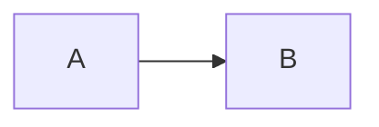

# 写作：Markdown

CommonMark + 表格、删除线、脚注、任务列表、代码高亮（Pygments）、mermaid 图、frontmatter、`[[wikilink]]`。

## frontmatter

```yaml
---
title: 数仓上手指南
tags: [dw, guide]
status: approved        # draft | review | approved | deprecated
author: alice@example.com
created: 2026-07-24
updated: 2026-09-01
task_scope: shared      # 任务列表全员共享；默认按读者
---
```

导入仓库文件时：没有 `title` 用第一个 `# 标题`，再没有用文件名；`created` / `updated` 决定时间轴位置，没有就看文件名开头的日期，再没有用提交时间。

## 任务列表

```markdown
- [ ] 跑测试
- [x] 更新文档
```

勾选自动保存（DocState，key `md-tasks`），默认按读者，`task_scope: shared` 全员共享。勾选后旁边会闪一下「已保存」。

## 链接

- `[[slug]]`、`[[标题]]`、`[[slug|显示文字]]`：wikilink，按 slug、slugify 后的名字、标题、slug 后缀依次解析；解析不到显示为虚线文字，鼠标悬停看目标。
- 相对链接（导入仓库的文档）：`zh/01-quickstart.md` → 站内文档；`sop/` → 分类页；其它仓库文件 → `DOCSTATE_SOURCE_REPO_URL`；图片暂不改写。
- 站外链接在新标签页打开。

## 代码与图

```markdown
```python
print("hi")
```


```

mermaid 从 jsdelivr 加载（沙箱 CSP 允许的两个 CDN 之一）。

## 目录（README）

每个目录的 `README.md` 显示在对应分类页顶部，仓库根的 `README.md` 显示在首页。
