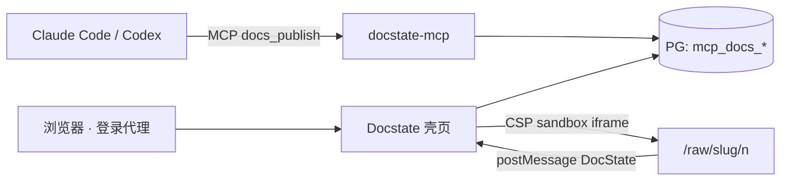

# Markdown 渲染能力一览

这一篇是 Markdown 源文件直接发布，服务端渲染成 HTML 后和 HTML 文档走同一条路：同样的 iframe 隔离、同样的状态桥。frontmatter 里的标题、标签、日期会进目录和时间轴。

## 表格与强调

| 能力 | 状态 | 说明 |
|---|---|---|
| GFM 表格 | ✅ | 宽表横向滚动，不撑破页面 |
| 任务列表 | ✅ | 见下 |
| 代码高亮 | ✅ | Pygments，`python` / `sql` / `bash` 等 |
| Mermaid | ✅ | 客户端渲染，脚本来自 jsdelivr |
| 脚注 | ✅ | 见文末[^1] |
| Wikilink | ✅ | 能解析到已发布文档的变成链接，解析不到的保留为灰色 |
| ~~删除线~~ | ✅ | GFM strikethrough |

## 任务列表

勾选会自动保存，刷新不丢；默认只对你自己可见。文档 frontmatter 里加一行 `task_scope: shared`，就变成全员共享的一份。

- [x] 从 docs 仓导入现有文档
- [x] 分类树、时间轴、版本历史
- [ ] 中文分词搜索（第二期）
- [ ] 图片资产上传（第二期）

## 代码高亮

```python
def publish(session, *, title, content, kind, category, author, slug=None):
    """同一 slug 再次发布只追加版本，URL 不变。"""
    doc = get_doc(session, slug) if slug else None
    if doc is None:
        doc = Doc(slug=unique_slug(session, make_slug(title, slug)), title=title)
    return append_version(session, doc, content, author)
```

```sql
SELECT ds, COUNT(DISTINCT profile_id) AS dau
FROM dwd.dwd_user_events_di
WHERE ds BETWEEN '20260901' AND '20260907'
GROUP BY ds
ORDER BY ds
LIMIT 7;
```

## Mermaid



## Wikilink 与引用

- 能解析的：[[001-tailscale-overview]]、[[001-tailscale-overview|Tailscale 网络总览]]
- 解析不到的：[[一篇不存在的文档]]
- 普通链接：[Docstate 仓库](https://github.com/qiaob/docs-site)

> 引用块：设计评审阶段只产出分析和文档，不建 worktree、不写代码；等用户明确「开始实施」再动手。

## 长内容与图片

正文里的图片会自适应宽度；表格和代码块超宽时在自己的容器里横向滚动，页面本身不会出现横向滚动条。

[^1]: 脚注由 mdit-py-plugins 的 footnote 插件渲染，锚点在同一文档内跳转。
